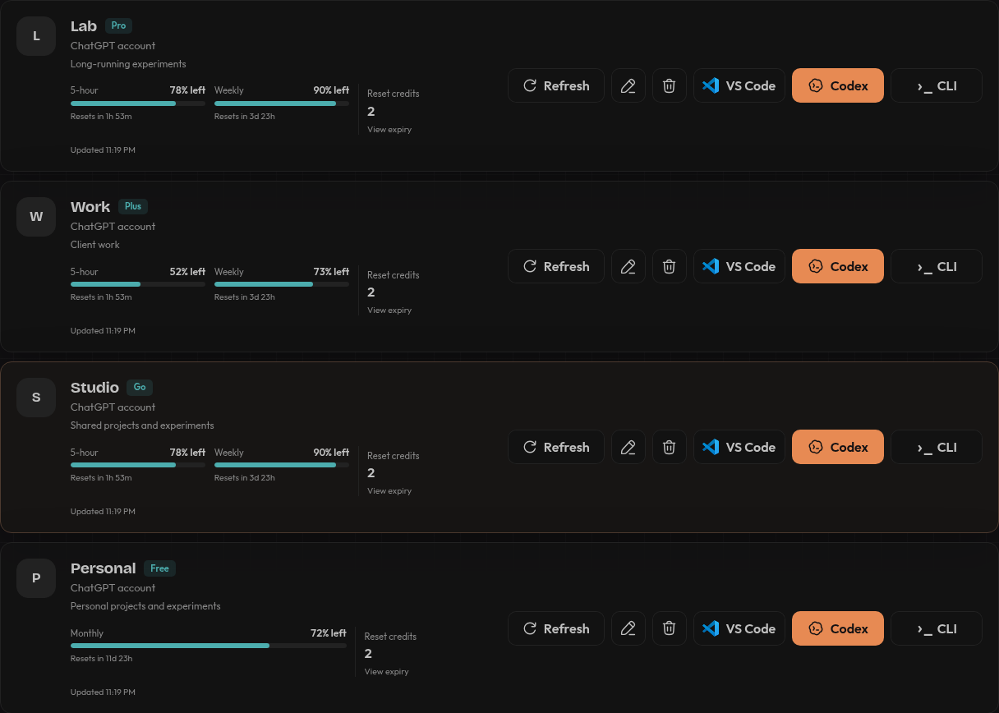
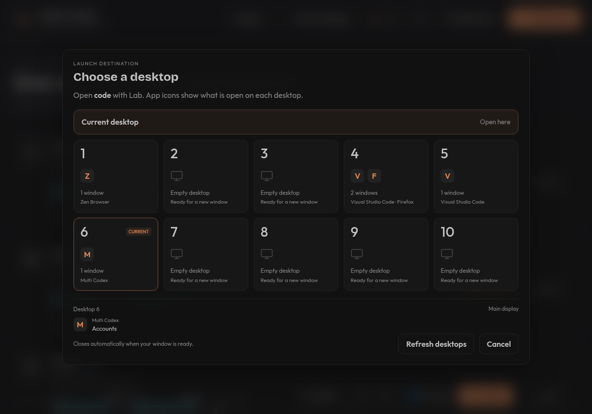

# Multi Codex

Your Codex accounts, your choice of VS Code, the Codex app, or CLI. Keep your default login untouched.





Install and update use the [latest release](https://github.com/wrestle-R/multi-codex/releases/latest), including its matching installer scripts. Current release: **v1.3.5**.

## Add an account

Click **Add account** and choose one of three options:

- **Sign in with browser** — use the sign-in link and one-time code to connect another account.
- **Paste JSON** — paste the contents of an existing Codex `auth.json` file.
- **Import current** — save a copy of your current Codex login without changing the original.

Accounts appear in plan order: **Pro → Plus → Go → Free**. Usage limits refresh automatically when the app opens.

## Linux

AppImage for Linux x86_64. See [platform support](docs/platform-support.md) for distribution requirements and desktop integrations.

### Install

```bash
curl -fsSL https://github.com/wrestle-R/multi-codex/releases/latest/download/install-app.sh -o /tmp/install-multi-codex.sh
bash /tmp/install-multi-codex.sh
```

### Update

```bash
curl -fsSL https://github.com/wrestle-R/multi-codex/releases/latest/download/update-app.sh -o /tmp/update-multi-codex.sh
bash /tmp/update-multi-codex.sh
```

## Mac

Apple Silicon and macOS 26 or newer. This release has no Apple Developer ID signature and is not notarized; the Mac commands explicitly allow the checksum-verified unsigned build.

Open Multi Codex once. If macOS blocks it, go to **System Settings → Privacy & Security → Open Anyway**, then confirm **Open**. [Apple's first-open instructions](https://support.apple.com/en-us/102445). The installer keeps Gatekeeper and quarantine protections in place.

### Install

```bash
curl -fsSL https://github.com/wrestle-R/multi-codex/releases/latest/download/install-app.sh -o /tmp/install-multi-codex.sh
MULTI_CODEX_ALLOW_UNSIGNED_MAC=1 bash /tmp/install-multi-codex.sh
```

### Update

```bash
curl -fsSL https://github.com/wrestle-R/multi-codex/releases/latest/download/update-app.sh -o /tmp/update-multi-codex.sh
MULTI_CODEX_ALLOW_UNSIGNED_MAC=1 bash /tmp/update-multi-codex.sh
```

Updates replace the app while preserving saved accounts and profile data. Close Multi Codex before updating. To update without launching it, add `MULTI_CODEX_NO_LAUNCH=1` to the command.

Standalone launch supports verified Codex desktop version `26.930.51102`. See [tested platforms and remaining validation](docs/platform-support.md).

Install the Codex extension in each isolated VS Code profile before using Codex there.
