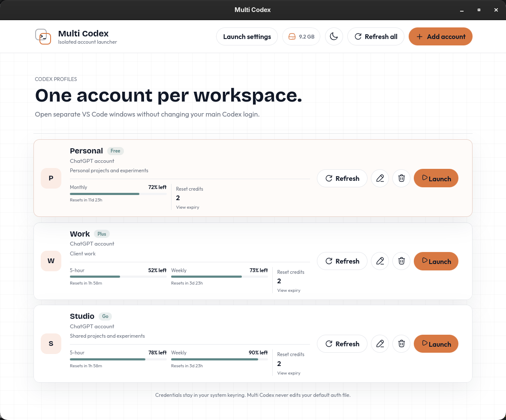
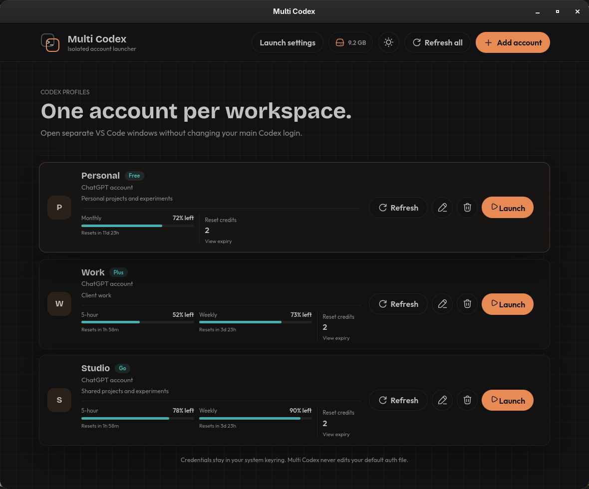

# Multi Codex

Launch multiple Codex accounts in isolated VS Code windows without changing your default Codex login. Re-launching an account opens another VS Code window, including for the same workspace.

Multi Codex shows live 5-hour and weekly limits for paid ChatGPT accounts, the 30-day limit reported for Free accounts, and expiry details for reset credits when Codex supplies them. The 2.4.0 candidate adds desktop window previews and verified placement for Hyprland, plus GNOME and KDE integrations. Launching opens a built-in folder picker modal over the app, starting in `~/Desktop/code` when available; no external file manager is opened.

Select the storage total in the top-right corner to see a per-profile breakdown. Safe cache cleanup preserves credentials, conversations, settings, skills, plugins, and installed extensions; full profile deletion always requires separate confirmation.





## 2.4.0 candidate status

The desktop-picker implementation and platform adapters are under validation. **2.4.0 is not cleared for publication:** standard macOS Spaces support and real-device/package tests remain blocked or pending. Current public downloads below remain v2.3.3. See [platform support and setup](docs/platform-support.md) and [release gates](docs/releases/v2.4.0-validation.json).

## Safe updates

The installer and updater replace only the application binary. They do not delete or recreate your saved profiles, isolated workspaces, or account credentials. Existing Linux installs in `~/.local/bin/multi-codex.AppImage` are updated in place; new installs use that location as well.

## Arch Linux

Install and launch:

```bash
curl -fsSL https://raw.githubusercontent.com/wrestle-R/multi-codex/main/scripts/install-app.sh -o /tmp/install-multi-codex.sh
bash /tmp/install-multi-codex.sh
```

[Download v2.3.3 for Arch Linux](https://github.com/wrestle-R/multi-codex/releases/download/v2.3.3/Multi.Codex_2.3.3_amd64.AppImage)

## macOS

Install and launch:

```bash
curl -fsSL https://raw.githubusercontent.com/wrestle-R/multi-codex/main/scripts/install-app.sh -o /tmp/install-multi-codex.sh
bash /tmp/install-multi-codex.sh
```

[Download v2.3.3 for macOS](https://github.com/wrestle-R/multi-codex/releases/download/v2.3.3/Multi.Codex_2.3.3_universal.dmg)

## Update

```bash
curl -fsSL https://raw.githubusercontent.com/wrestle-R/multi-codex/main/scripts/update-app.sh -o /tmp/update-multi-codex.sh
bash /tmp/update-multi-codex.sh
```

Set `MULTI_CODEX_NO_LAUNCH=1` when updating from a terminal and you only want to replace the binary. Close and reopen Multi Codex afterward to use the new version.
