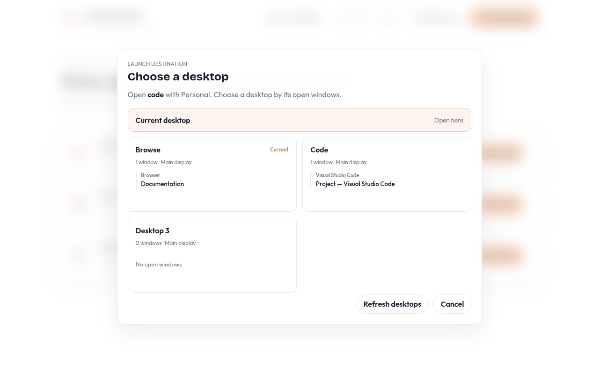
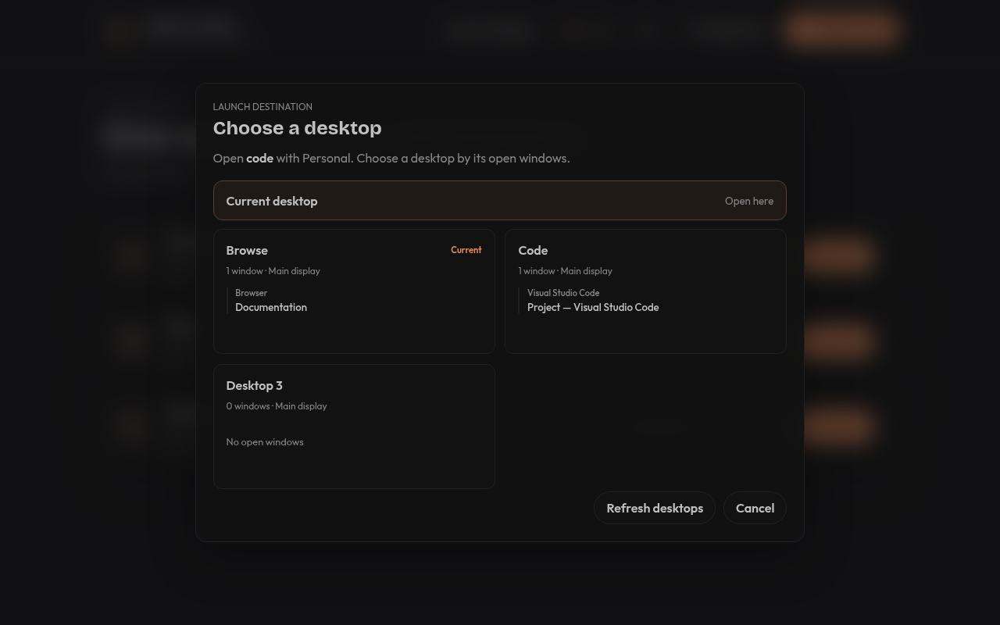
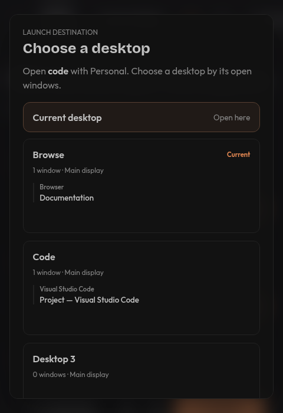
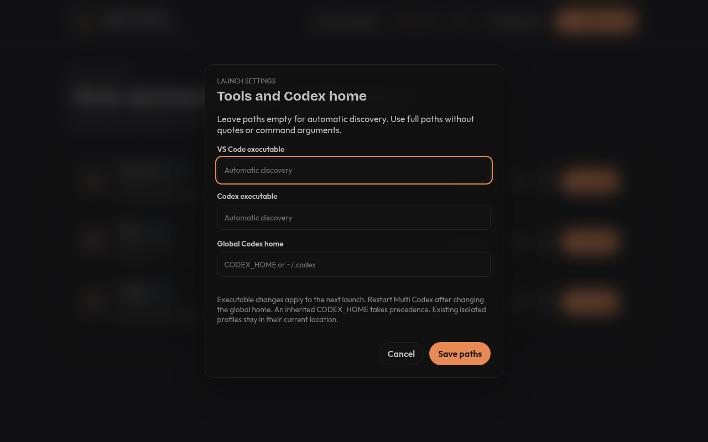

# Local verification of the 1.3.0 candidate

Recorded on October 3, 2026. Host: Arch Linux x86_64, Hyprland 0.56.2. Isolated compositor: KWin 6.7.5 Wayland. These results do **not** clear the native macOS or full packaged-functional release gates.

| Check | Result |
| --- | --- |
| Frontend suite | 38 passed |
| Rust suite | 56 passed; two environment-specific checks excluded from the default suite and run separately |
| Rust lint | `cargo clippy --all-targets -- -D warnings` passed |
| Rust formatting | `cargo fmt -- --check` passed |
| Repeated-window regression | 20 consecutive passes |
| Release/installer Node checks | Four passed, including twelve installer platform/version scenarios |
| Production frontend build | Passed |
| Linux packaging | AppImage, DEB and RPM built; AppImage's existing patched-repack fallback completed successfully |
| Package contents | Desktop integration resources present in DEB/RPM and AppDir |
| Live Hyprland inventory | Five desktops and five windows read successfully; no user windows moved |
| Live isolated KDE bridge | Inventory, empty desktop, actual test-window placement and missing destination passed |
| Packaged AppImage smoke check | Native Multi Codex window appeared in isolated KDE inventory |
| Browser checks | Eight screenshots captured; desktop/narrow layouts, focus trapping, Escape dismissal, accessible narrow footer and successful preview launch checked; no page errors or horizontal dialog overflow |
| Workflow checks | YAML parsed and actionlint 1.7.12 passed |
| Shell scripts | Bash syntax checks passed |
| Tracked secret scan | Passed |
| Publication gate | Correctly refuses publication with missing macOS/packaged validation and tested-artifact hashes |

One repeated-launch test failed during an earlier concurrent build/test run with the previous generic spawn error. It did not reproduce in a targeted rerun, the full suite, or twenty consecutive targeted runs. Launch errors now preserve the underlying OS error so any recurrence can be diagnosed; no claim is made that an unidentified intermittent cause has been fixed.

The browser screenshots use demo profiles and window inventories. They verify UI behavior/layout, not native desktop compatibility. Native KDE placement was checked independently against a virtual compositor and an actual GTK window. The AppImage smoke check verifies startup/native-window visibility, not login, credentials, upgrades or a full VS Code placement transaction.

## Review screenshots









All eight original captures remain in the ignored `tauri/test-results/screenshots` directory. Four representative captures are committed here.

## Reproduce the checks

```bash
cd tauri
npm test
npm run test:release-gates
npm run test:release
npm run build
cargo fmt --manifest-path src-tauri/Cargo.toml -- --check
cargo clippy --manifest-path src-tauri/Cargo.toml --all-targets -- -D warnings
cargo test --manifest-path src-tauri/Cargo.toml
cargo test --manifest-path src-tauri/Cargo.toml live_hyprland_inventory -- --ignored --nocapture
npm run release:linux
MULTI_CODEX_TEST_APPIMAGE="$PWD/src-tauri/target/release/bundle/appimage/Multi.Codex_1.3.0_amd64.AppImage" bash scripts/test-kde-bridge.sh
npm run check:secrets
```

`npm run check:release-gates` is expected to exit with status 1 until the real validation requirements in [the release manifest](v1.3.0-validation.json) pass. There is no published 1.3.0 release from this work, and no successful macOS build or real-Mac test has been claimed.
